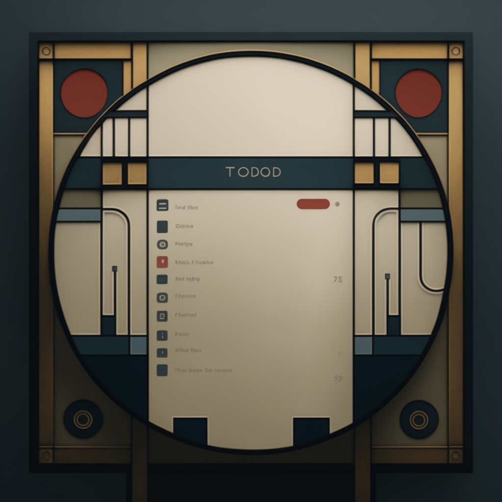

# Deco Todo

## Running
Just run the following commands:
```
npm install
npm start
```

## Why I did this
The UI was designed with [MidJourney](https://www.midjourney.com/home/?callbackUrl=%2Fapp%2F#about), and I wanted to see if I could recreate the design purely with CSS. Here is the original design:



## Notes
I only spent one day on this, so this is only the basic design. It's not an exact copy. If this were a real project, I would spend the time to fine tune the design.
